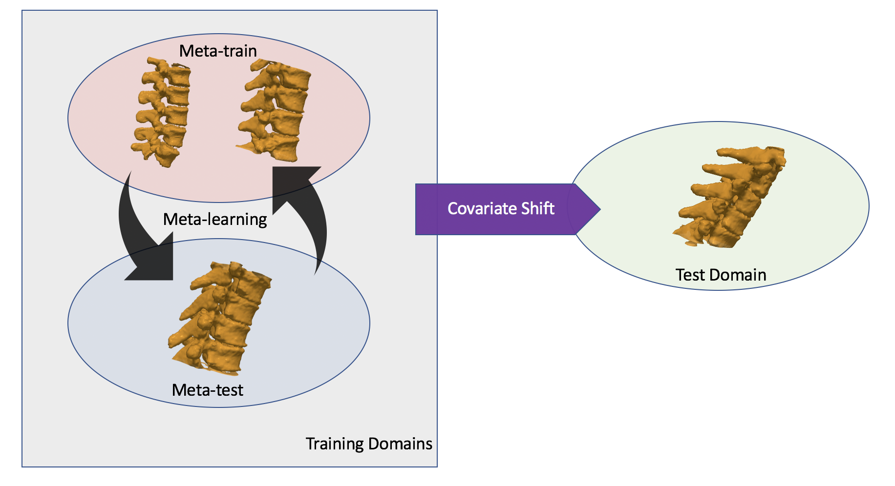

# Domain Generalizer: A Few-shot Meta Learning Framework for Domain Generalization in Medical Imaging

PyTorch code for the MICCAI 2020 paper [Domain Generalizer: A Few-shot Meta Learning Framework for Domain Generalization in Medical Imaging]() to be presented at [Domain Adaptation and Representation Transfer (DART) 2020](https://sites.google.com/view/dart2020).




### Code
- `mldg-seg` folder consists is the main directory for all the PyTorch code
- `postprocess` folder consists of code for computing the evaluation metrics, statistics and retaining the largest connected component
- `data_split_up` folder consists of all the domain splits
- `requirementst.txt` contains the majority of the libraries used


### References

- The current work is developed upon the awesome work by: [Learning to Generalize: Meta-Learning for Domain Generalization](https://arxiv.org/pdf/1710.03463.pdf)

- For a comprehensive overview of CT vertebrae segmentation look at the MSc thesis: [Spine segmentation in computed tomography images using geometric flows and shape priors](https://escholarship.mcgill.ca/concern/theses/4b29bb21t) by Pulkit Khandelwal, and supervised by [Prof. Kaleem Siddiqi](http://www.cim.mcgill.ca/~siddiqi/) and [Prof. D. Louis Collins](http://nist.mni.mcgill.ca/) at McGill University.

- See the paper for the complete list of references.

- Code:
  - Code adapted and inspired from: [Learning to Generalize: Meta-Learning for Domain Generalization](https://github.com/HAHA-DL/MLDG) 
  - Unet architecture, losses at [pytorch-3dunet](https://github.com/wolny/pytorch-3dunet) 
  - Post-processing and miscellaneous functions [MIC-DKFZ/nnUNet](https://github.com/MIC-DKFZ/nnUNet) 


### Citing the work

```
to be updated
```
